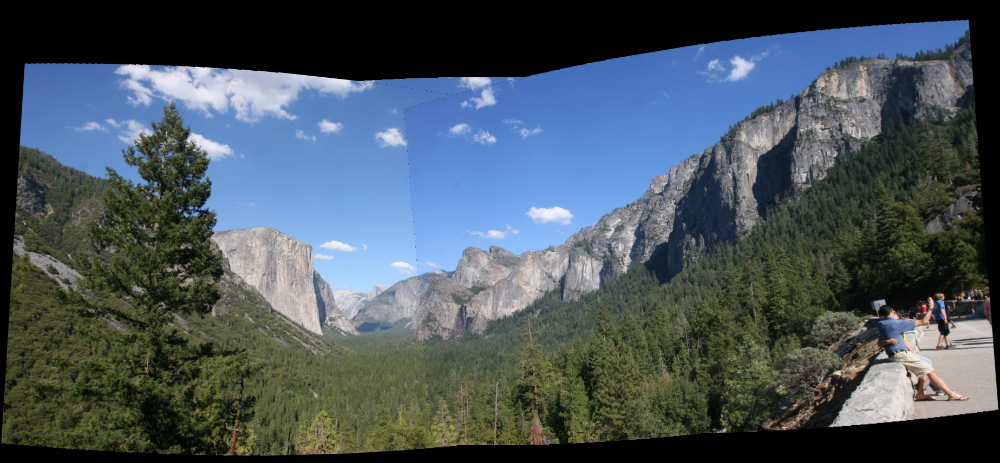

# Panorama Stitching

## Overview

This project focuses on creating a panorama by stitching multiple images together using feature detection and matching techniques. The goal is to align and merge images seamlessly, producing high-quality panoramic images. The project leverages advanced computer vision methods, including:

- **Feature detection** using algorithms like SIFT (Scale-Invariant Feature Transform)
- **Feature matching** to align corresponding points across images
- **Homography estimation** to transform images into a common plane
- **Image blending** to merge overlapping regions smoothly

The project also explores the optimization of the stitching pipeline for improved accuracy and performance.

## Files and Directory Structure

### Data

- `data1`, `data2`, `data3`, `data4`: These directories contain the raw image datasets used for stitching into a panorama.
- `data.xlsx`: A data file that includes metadata about the images, such as image properties, filenames, or transformations applied during the project.

### Results and Intermediate Outputs

- `matching_result/`: Contains the output of feature matching between images, including visualizations of matched keypoints and their corresponding matches across images.
  - Example:
      
    *Figure 1: Visual representation of feature matching between two images.*

- `sift/`: Contains the SIFT feature maps generated for each image, showing the detected keypoints and descriptors used for matching.
  - Example:
      
    *Figure 2: SIFT keypoints detected in an input image.*

- `result/`: Contains the final stitched panorama images produced by merging all input images.
  - Example:
      
    *Figure 3: Final panorama image produced by the pipeline.*

### Notebooks and Scripts

- `Panorama_Stitching.ipynb`: Implements the core functionality for panorama stitching, including feature detection, descriptor matching, homography computation, and image blending.
- `main.ipynb`: The main notebook orchestrating the panorama stitching process, loading data, and processing images step-by-step.

### Documentation and Reports

- `Homework2_2024.pdf`: A report that describes the project methodology, challenges, results, and conclusions.
- `22421378.pdf`: Another document related to the project, possibly containing references or supplementary material.
- `pdf_report.pdf`: The final detailed report summarizing the project findings and performance evaluation.

### Environment and Dependencies

- `envs.yml`: A Conda environment file for creating a virtual environment that matches the dependencies required for the project. You can create the environment with the following command:
  ```bash
  conda env create -f envs.yml
  ```

- `requirements.txt`: Contains a list of Python dependencies needed to run the project. Install them using:
  ```bash
  pip install -r requirements.txt
  ```

## Running the Project

1. Clone the repository:
   ```bash
   git clone https://github.com/anthonyhuang19/Panorama-Stitching.git
   cd Panorama-Stitching
   ```
2. Set up the environment:
   ```bash
   conda env create -f envs.yml
   conda activate panorama_env
   ```
3. Run the Jupyter notebooks to execute the panorama stitching pipeline:
   ```bash
   jupyter notebook
   ```
4. View the results in the `result/` directory.

## References

For more details, refer to `pdf_report.pdf`.

